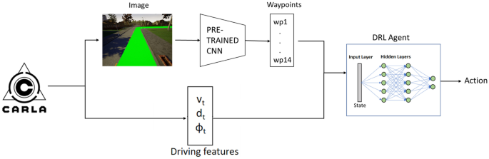

# CARLA_AutoNav  
Autonomous Navigation in CARLA using Deep Q-Networks (DQN)

This repository contains the implementation of a **Deep Reinforcement Learning–based autonomous navigation system** built in the **CARLA simulator**.  
The project integrates **Deep Q-Networks (DQN)** for decision-making along with **semantic segmentation** (RESNET + UNET) for environment understanding, enabling autonomous driving and behavior prediction in a realistic 3D traffic environment.

---

## 🚗 Project Overview

Autonomous driving requires real-time perception, scene understanding, and continuous control decisions.  
This project focuses on:

- Predicting **vehicle behavior** in dynamic traffic  
- Generating **steering** and **throttle commands** in real time  
- Leveraging **deep reinforcement learning** to learn optimal driving policies  
- Using **semantic segmentation** for enhanced visual context  

It is fully developed inside the **CARLA 3D driving simulator**.

---

## 🧠 Core Components

### 🔹 **1. Deep Q-Network (DQN) for Navigation**

The DQN learns to:
- Maintain lane discipline  
- Avoid collisions  
- React to traffic conditions  
- Make optimal steering/throttle decisions  
- Navigate through intersections and curves  

The agent takes:
- Segmented scene images  
- Optional numerical cues (e.g., GPS direction indicators)

And outputs:
- Steering angle  
- Throttle command  

---

### 🔹 **2. Semantic Segmentation (RESNET + UNET)**  
A custom semantic segmentation pipeline was built to improve perception.

- **RESNET Backbone** → robust feature extraction  
- **UNET Decoder** → pixel-wise segmentation  

Used to classify:
- Road  
- Vehicles  
- Pedestrians  
- Lane markings  
- Sidewalks  
- Obstacles  

This enhanced perception strengthens the DQN’s decision-making ability.

---

### 🔹 **3. Adaptive Control Algorithms**
Real-time adaptive logic adjusts:
- Steering angle  
- Acceleration / throttle  
- Speed regulation based on scene complexity  

This ensures smooth and safe driving behavior even in dense traffic.

---

## 🏗 Workflow

1. **Collect CARLA sensor data**  
   - Camera RGB  
   - Semantic images  
   - Vehicle state  

2. **Train RESNET-UNET segmentation model**  
   - Generate pixel-level scene understanding  

3. **Feed segmentation output to the DQN agent**  
   - Agent observes segmented frames  

4. **Train DQN on CARLA environment**  
   - Reward functions for lane-keeping, safety, smoothness  

5. **Deploy & test agent in urban traffic**  
   - Evaluate driving stability  
   - Measure collision rate, lane-keeping accuracy  

---

## 📂 Repository Structure (Suggested)

